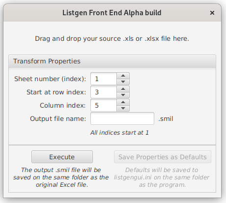

# listgen-app
A mixed JVM application with a JavaFX frontend and a Scala backend to convert spreadsheet files into .smil files

Project organization
--------------------

This project is organized in two directories: `listgen` is the base application, written in Scala, with Sbt as the build
tool. `listgengui` was created later: originally meant to simply be a JavaFX frontend for `listgen`, it required a
complete project overhaul in order to be buildable with the post Java 9 version that JavaFX demanded; and thus the 
entire project had to be created as a Java modular application, requiring some tinkering with the base libraries as well
as the building method. It uses Gradle as the build tool.

Requirements
------------

This project requires Java 14+ and Java FX 14+, as well as Scala 2.13

Application description
-----------------------

`listgengui` is a simple drag-and-drop file converter with 3 customizable options, as seen in the following
screenshot:



To execute the application, navigate to `listgengui/` in a terminal and then execute:
```
gradle frontend:run
```
The build
process will take a while the first time, but once it's complete, you will see the application open and show something
like what you see on that screenshot.

You can find a sample file to tinker with in `listgengui/backend/src/resources/`. Drag it to the demarcated area in the
app and increase the sheet number to 2 (since that's the sheet containing the data in that file), then press
`Execute`. You will see 2 files are created in the same directory, a .txt for error checking, and a .smil file.

That's it! It's a simple application for a simple purpose, it does one thing, and it does it well.

Backend
-------

If you're curious about the Scala backend, you won't be able to build it (yet) with the Gradle tool. Instead, navigate
to `listgen/` in a terminal and then execute:
```
sbt run
```
After the build process is finished, you will see some text
printed to the screen, and execution will stop. That's the application running without arguments printing the base help
text. Running it with the corresponding arguments is equivalent to executing it through the Gui, since all the Gui does
is translate the visual input into arguments for the function executed by this Scala application.

Acknowledgments
---------------

Special thanks to my customer for letting me open source this tool, and to Li Haoyi for his excellent Scala library,
which simplified my work even more than Scala alone already did. Pay him a visit at https://github.com/lihaoyi
